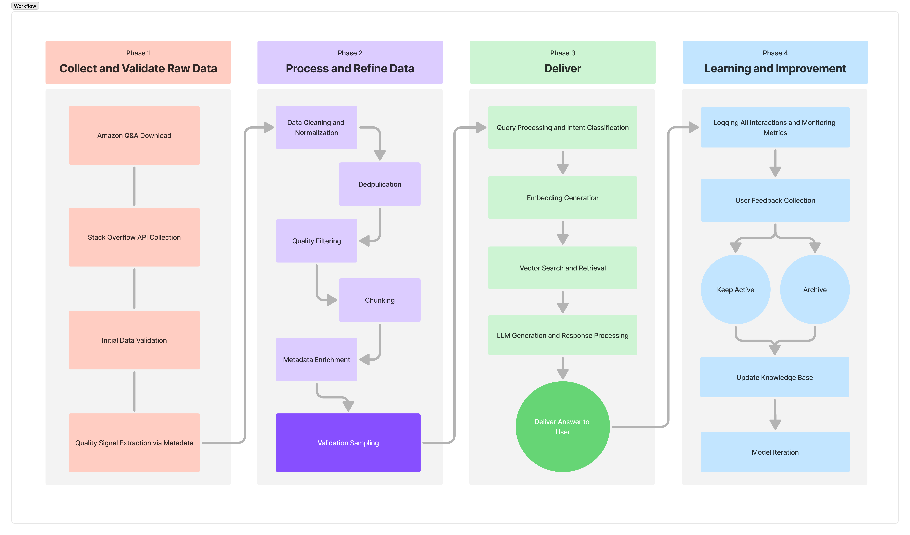

# RAG-Powered-Customer-Support-Chatbot

## Description
This project implements an end-to-end RAG (Retrieval-Augmented Generation) architecture that mitigates LLM hallucinations by grounding responses in retrieved factual content from domain-specific knowledge bases. The system uses public Amazon and Stack Overflow datasets with over a million of raw customer support Q&A pairs across a variety of topics (e-commerce, technical support, general Q&A). The RAG pipeline is designed to index and retrieve from this data efficiently, while returning grounded answers with explicit source attribution.

## RAG Workflow
